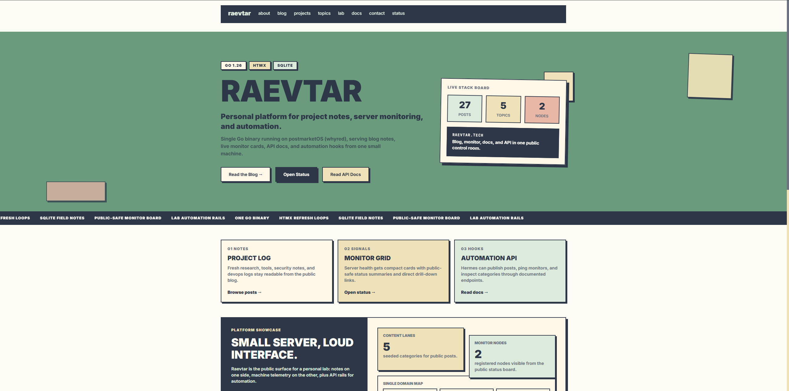
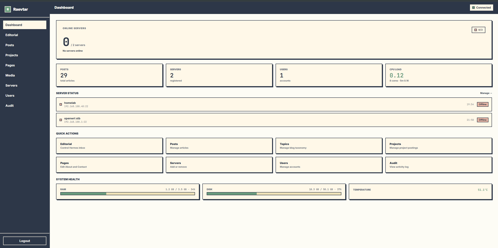

# Raevtar

Raevtar adalah platform personal yang jalan sebagai satu binary Go: blog, public lab, dashboard monitoring server lokal, admin panel, dan REST API kecil. Target utamanya tetap sederhana: hemat resource, cukup aman untuk dibuka lewat domain pribadi, dan bisa jalan di Linux, macOS, atau Windows tanpa CGO.

Footprint runtime Raevtar biasanya tetap kecil: sekitar **24 MB RSS**, CPU idle nyaris nol, binary sekitar **17.5 MB**, dan SQLite database masih di bawah **1 MB** untuk pemakaian saat ini. Angka ini adalah observasi operasional, bukan benchmark universal lintas semua deployment.

<p align="center">
  
</p>

## Current Scope

| Area | Status |
|------|--------|
| Blog | Markdown posts, kategori, tags, RSS, cover image, media upload, view tracking, OG images |
| Monitoring | Push-based agent telemetry, public-safe dashboard, admin diagnostics, alert webhooks |
| Admin | Session login, RBAC, posts/media/servers/users/audit log, webhooks, page editor, command queue |
| API | Public read endpoints + protected write/monitoring/search endpoints |
| SEO | Sitemap XML, JSON-LD structured data, LLMs.txt, canonical URLs, Open Graph |
| CI/CD | GitHub Actions test+build, GoReleaser multi-platform releases |
| Hardening | Request caps, login throttling, CSP, generic 500s, production secret checks |

Raevtar bukan multi-tenant SaaS. Ini personal app untuk `raevtar.tech`, dengan boundary jelas antara tampilan publik dan data operator.

## Features

### Blog

- Artikel Markdown disimpan di SQLite dan dirender pakai Goldmark.
- Topic blog dikelola lewat `categories`; default seed awal: AI Agent, Security, Kernel & Embedded, DevOps, Tools.
- Tags normalized (`tags` + `post_tags`) dan badge di UI.
- Admin Content Studio: draft/publish, Markdown preview, media upload, cover image, dan topic management di `/admin/topics`.
- RSS feed di `/blog/feed.xml`.
- View tracking per artikel via IP hash (SHA-256, 8 hex chars).
- Dynamic OG image SVG per post di `/og-image/blog/{slug}`.
- API `POST /api/v1/posts` untuk integrasi agent seperti Hermes.

### Projects

- Project entries disimpan sebagai content type terpisah dari blog posts.
- Public archive ada di `/projects` dengan featured lane, state filter, sort order, dan detail page per slug.
- Tiap project sekarang bisa punya timeline/build log, changelog publik di `/projects/{slug}/changelog`, related content rail, dan showcase sections terstruktur.
- Homepage bisa menampilkan featured published projects sebagai preview lane.
- Admin panel bisa mengatur `state`, `featured`, `sort_order`, timeline entries, related links, dan showcase items.
- Protected API sekarang mendukung create, update, dan delete project entries, update entries, relations, dan showcase items untuk workflow operator/agent.

### Public Monitoring

- `/dashboard` menampilkan status semua node tanpa membuka topology privat.
- `Platform System Health` menampilkan snapshot host Raevtar: CPU load, RAM, disk, temperature jika ada.
- Tiap node punya `System Health` public-safe: CPU %, load, cores, RAM, disk, temperature, uptime, latest sample age, sample count, history window, dan availability aggregate.
- HTMX refresh: grid tiap 30 detik, detail node tiap 15 detik.
- Public view tidak menampilkan host/IP, port, tags privat, token, install command, audit log, atau raw setup detail.

### Admin Panel

- Login session di `/admin/login`.
- RBAC role: `owner`, `admin`, `operator`, `readonly`.
- Manage posts, blog topics, projects, media, servers, users, webhooks, pages, dan audit log.
- Editorial inbox di `/admin/editorial-inbox` untuk managing content queue Hermes.
- Page editor di `/admin/pages` untuk manage static pages (about, contact).
- Server diagnostics di `/admin/servers/{id}` berisi endpoint, metric history, setup command, token rotation, command queue, dan activity log admin-only.
- Webhook management di `/admin/webhooks` untuk manage alert endpoints.

<p align="center">
  
</p>

### REST API

| Method | Path | Scope |
|--------|------|-------|
| `GET` | `/api/v1/posts` | Public list posts; supports `category` filter |
| `POST` | `/api/v1/posts/{id}/read-time` | Public record read session (IP-hashed) |
| `POST` | `/api/v1/posts` | Admin key required |
| `GET` | `/api/v1/search` | Public search; supports `q`, `scope=posts\|projects\|pages`, `page`, `page_size` |
| `GET` | `/api/v1/projects` | Public list projects; supports `featured=true`, `state=planning\|active\|paused\|shipped\|archived`, `sort=newest\|oldest` |
| `GET` | `/api/v1/projects/{slug}/updates` | Public published project timeline |
| `GET` | `/api/v1/projects/{slug}/changelog` | Public published changelog entries |
| `GET` | `/api/v1/projects/{slug}/relations` | Public related posts/projects |
| `GET` | `/api/v1/projects/{slug}/showcase` | Public published showcase items |
| `POST` | `/api/v1/projects` | Admin key required |
| `PUT` | `/api/v1/projects/{id}` | Admin key required |
| `DELETE` | `/api/v1/projects/{id}` | Admin key required |
| `POST` | `/api/v1/projects/{id}/updates` | Admin key required |
| `PUT` | `/api/v1/projects/updates/{updateID}` | Admin key required |
| `DELETE` | `/api/v1/projects/updates/{updateID}` | Admin key required |
| `POST` | `/api/v1/projects/{id}/relations` | Admin key required |
| `DELETE` | `/api/v1/projects/relations/{relationID}` | Admin key required |
| `POST` | `/api/v1/projects/{id}/showcase` | Admin key required |
| `PUT` | `/api/v1/projects/showcase/{itemID}` | Admin key required |
| `DELETE` | `/api/v1/projects/showcase/{itemID}` | Admin key required |
| `GET` | `/api/v1/categories` | Public categories |
| `GET` | `/api/v1/servers` | Admin key required |
| `GET` | `/api/v1/servers/{id}` | Admin key required |
| `POST` | `/api/v1/servers` | Admin key required; returns one-time `agent_token` |
| `POST` | `/api/v1/servers/{id}/ping` | Agent token or admin key |
| `GET` | `/api/v1/servers/{id}/commands` | Agent polling pending commands |
| `POST` | `/api/v1/servers/{id}/commands/result` | Agent report command result |
| `GET` | `/api/v1/hoststats` | Admin key required |
| `GET` | `/api/v1/editorial-inbox` | Admin key; list inbox items |
| `GET` | `/api/v1/editorial-inbox/contract` | Admin key; machine-readable contract |
| `GET` | `/api/v1/editorial-inbox/summary` | Admin key; analytics summary |
| `POST` | `/api/v1/editorial-inbox` | Admin key; create item |
| `POST` | `/api/v1/editorial-inbox/claim` | Admin key; claim next ready item |
| `GET` | `/api/v1/editorial-inbox/{itemID}` | Admin key; detail item |
| `POST` | `/api/v1/editorial-inbox/{itemID}` | Admin key; update item |
| `POST` | `/api/v1/editorial-inbox/{itemID}/complete` | Admin key; mark done |
| `POST` | `/api/v1/editorial-inbox/{itemID}/fail` | Admin key; mark failed |
| `GET` | `/api/v1/bootstrap/{serverID}/{token}` | Agent bootstrap (one-time token auth) |
| `GET` | `/docs`, `/lab/docs` | Public-safe docs |
| `GET` | `/docs/api` | Public API reference page |

Public docs sengaja hanya menjelaskan read-only surface dan privacy boundary. Endpoint admin/server setup tetap operator-only.

### Blog topic management

- Public topic switchboard tetap hidup di `/blog` dan `/topics`.
- Admin topic management sekarang hidup di `/admin/topics` dan memakai entity `categories` yang sama dengan public blog surface.
- Topic slug harus lowercase kebab-case.
- Topic yang sudah dipakai post **tidak bisa** dihapus atau diganti slug-nya, supaya filter publik seperti `/blog?category=...` tetap stabil.

### Project write payload shape

Create project via `POST /api/v1/projects`:

```json
{
  "title": "Whyred Watchtower",
  "content_md": "# Whyred Watchtower\n\nBuild log...",
  "excerpt": "Public-facing project note.",
  "cover_image_url": "/uploads/watchtower.png",
  "published": true,
  "state": "active",
  "featured": true,
  "sort_order": 1,
  "tags": ["oss", "monitoring"]
}
```

Update project via `PUT /api/v1/projects/{id}` memakai shape yang sama. Server mempertahankan slug yang sudah ada, memvalidasi `title` + `content_md`, menormalkan `sort_order` negatif menjadi `0`, dan default `state` ke `active` bila kosong.

### Project child resource payloads

Create/update project timeline or changelog entry:

```json
{
  "kind": "changelog",
  "title": "v0.3.0 public rollout",
  "content_md": "## Changed\n\n- Added project states\n- Added showcase rail",
  "published": true,
  "pinned": false,
  "sort_order": 0,
  "event_at": "2026-06-07T13:30:00Z"
}
```

- `kind` yang valid: `timeline`, `build_log`, `changelog`
- endpoint write:
  - `POST /api/v1/projects/{id}/updates`
  - `PUT /api/v1/projects/updates/{updateID}`
  - `DELETE /api/v1/projects/updates/{updateID}`

Create related content edge:

```json
{
  "target_type": "post",
  "target_id": 12,
  "relation_kind": "related",
  "sort_order": 0
}
```

- `target_type` yang valid: `post`, `project`
- `relation_kind` yang valid: `related`, `inspired_by`, `builds_on`

Create/update showcase item:

```json
{
  "kind": "image",
  "title": "Control room screenshot",
  "body_md": "Short note for what the reader is seeing.",
  "asset_url": "/uploads/watchtower-control-room.png",
  "external_url": "",
  "embed_provider": "",
  "embed_ref": "",
  "published": true,
  "sort_order": 0
}
```

- `kind` yang valid: `image`, `link`, `repo`, `metric`, `video`
- endpoint write:
  - `POST /api/v1/projects/{id}/showcase`
  - `PUT /api/v1/projects/showcase/{itemID}`
  - `DELETE /api/v1/projects/showcase/{itemID}`

## Agent Monitoring

Monitoring pakai push model, bukan SSH pull. Tiap perangkat jalanin agent ringan dan kirim metrics ke Raevtar:

```bash
RAEVTAR_URL=http://192.168.100.5:8080 \
RAEVTAR_SERVER_ID=2 \
RAEVTAR_AGENT_TOKEN=token-per-server \
/usr/local/bin/raevtar-agent.sh
```

Agent mengirim CPU percent, CPU load 1/5/15, core count, RAM used/total, disk used/total, uptime, online flag, dan temperature jika sensor tersedia. Token diambil dari `/admin/servers` atau response `POST /api/v1/servers`; token hanya ditampilkan saat create/rotate.

## Search

- Public search page di `/search` dengan HTMX partial updates.
- API search endpoint `GET /api/v1/search` dengan parameter `q`, `scope` (posts/projects/pages), `page`, `page_size`.
- Scope filter di UI untuk memilih antara posts, projects, dan static pages.

Search mencakup database query terhadap posts (title + excerpt + content), projects (title + excerpt + content), dan static pages (title + content). Hasil di-paginate per 10 item.

## SEO & Discovery

- **Sitemap XML** di `/sitemap.xml` — mencakup semua halaman statis, blog posts, projects, dan changelog pages.
- **LLMs.txt** di `/llms.txt` — ringkasan site buat LLM discovery, berisi core pages, RSS, sitemap, dan recent content.
- **Robots.txt** dinamis di `/robots.txt` — mengizinkan indexing penuh, Sitemap URL dari konfigurasi domain.
- **JSON-LD structured data** — `BlogPosting` schema untuk artikel, `CreativeWork` untuk projects, `WebSite` untuk homepage.
- **Canonical URLs** — semua halaman punya canonical link.
- **Open Graph images** — dynamic SVG OG image tiap blog post (`/og-image/blog/{slug}`) dan project (`/og-image/project/{slug}`) dengan gaya neo-brutalist (1200x630px).

SEO data disiapkan oleh `SiteMetaService` dan di-render via Templ di layout `base.templ`.

## Webhook Alerts

- Konfigurasi webhook via admin panel `/admin/webhooks` atau API.
- Setiap webhook bisa di-enable/disable dengan HMAC-SHA256 signature optional.
- Webhook di-fire otomatis saat threshold metrics server tercapai:

| Alert | Threshold |
|-------|-----------|
| `cpu_high` | CPU >= 90% |
| `ram_high` | RAM >= 90% |
| `disk_high` | Disk >= 90% |

- Payload berisi event type, server ID, timestamp, dan full metric snapshot.
- Signature dikirim via header `X-Webhook-Signature-256` (jika secret dikonfigurasi).
- Event log tiap webhook tercatat di database (response code + body, max 1000 chars).

## Command Queue

- Admin bisa mengantarkan command ke server via `/admin/servers/{id}`.
- Agent polling via `GET /api/v1/servers/{serverID}/commands` (mengembalikan pending commands).
- Agent melapor hasil via `POST /api/v1/servers/{serverID}/commands/result` dengan `command_id` dan `result`.
- Status lifecycle: `pending` → `running` → `completed` / `failed`.
- Command history per server tercatat di admin panel.

## CI/CD

- **GitHub Actions CI** — test + build di tiap push ke `main`/`dev-*` dan PR ke `main`.
- **GoReleaser** — build multi-platform (linux/darwin/windows, amd64/arm64) untuk tagged releases.
- Build step includes: `templ generate`, Tailwind CLI, lalu `go build`.
- Binary artifacts diupload ke GitHub Releases.

## Hardening Notes

- Production mode menolak start kalau `RAEVTAR_ADMIN_KEY` atau `RAEVTAR_ADMIN_PASS` kosong.
- API auth pakai bearer token dengan constant-time validation.
- Global rate limit in-memory: configurable per IP (`RAEVTAR_RATE_LIMIT_REQUESTS` per `RAEVTAR_RATE_LIMIT_WINDOW`).
- Admin login throttling in-memory: per `IP + username` dan IP-only spray guard.
- Request body dibatasi untuk login, API payload, admin forms, dan upload media (`RAEVTAR_MAX_UPLOAD_MB`).
- Internal server errors dikembalikan sebagai pesan generik; detail masuk log server.
- HTTP timeouts configurable: `RAEVTAR_READ_TIMEOUT`, `RAEVTAR_WRITE_TIMEOUT`, `RAEVTAR_IDLE_TIMEOUT`, `RAEVTAR_SHUTDOWN_TIMEOUT`.
- CSP memakai `script-src 'self'`; HTMX dan UI helper disajikan dari `/static/js/`.
- `RAEVTAR_TRUSTED_PROXY_CIDRS` opsional untuk membaca `CF-Connecting-IP` dari proxy tepercaya saja.

## Stack

| Lapisan | Teknologi |
|---------|-----------|
| Backend | Go 1.26, `github.com/go-chi/chi/v5` |
| Templates | `github.com/a-h/templ` |
| Frontend | SSR + self-hosted HTMX + Tailwind CSS |
| Database | SQLite via `modernc.org/sqlite` + `github.com/jmoiron/sqlx` |
| Markdown | `github.com/yuin/goldmark` |
| CI/CD | GitHub Actions + GoReleaser |
| Runtime target | Cross-platform (Linux/macOS/Windows), Cloudflare Tunnel optional |

## Struktur

```text
raevtar/
├── cmd/server/        # Entry point: config, DB, router, HTTP server
├── internal/
│   ├── config/        # Env-based config loader + CIDR parsing
│   ├── model/         # Data structs (post, category, server, tag, user, audit, SEO, webhook, command, page content, editorial inbox)
│   ├── repo/          # SQL queries + migration helpers (post, category, server, metric, tag, user, audit, webhook, command, view, page content, editorial inbox, media, project)
│   ├── service/       # Business logic (blog, project, search, site meta, pages, editorial inbox, media, monitor, admin, command queue, webhook)
│   ├── handler/       # HTTP handlers + routing + middleware + hardening
│   └── view/          # templ layouts, pages, admin views, components + presentation helpers
├── cron/              # Backup/automation scripts
├── migrations/        # Fresh SQLite schema
├── static/            # CSS, JS, agent script, uploads/static assets
├── .github/workflows/ # CI + release workflows
├── .goreleaser.yaml   # Multi-platform release config
└── docs/              # Canonical project docs, runbooks, and notes
```

## Arsitektur Layer

```text
Handler -> Service -> Repo -> SQLite
```

- Handler parse HTTP request, set response, dan render Templ.
- Service berisi business logic dan validasi; tidak tahu `http.Request`/`http.ResponseWriter`.
- Repo hanya query SQL dan mapping data.
- Model hanya struct.

## Konfigurasi

| Variable | Default | Keterangan |
|----------|---------|------------|
| `RAEVTAR_ADDR` | `:8080` | Listen address |
| `RAEVTAR_DB` | `~/.raevtar/data.db` | Path SQLite database |
| `RAEVTAR_MEDIA_DIR` | `~/.raevtar/uploads` | Direktori upload media publik |
| `RAEVTAR_DOMAIN` | `raevtar.tech` | Domain public |
| `RAEVTAR_LOG_LEVEL` | `info` | `debug`, `info`, `warn`, `error` |
| `RAEVTAR_ADMIN_KEY` | `""` | Wajib untuk API protected |
| `RAEVTAR_ADMIN_USER` | `admin` | Seed admin username |
| `RAEVTAR_ADMIN_PASS` | `""` | Wajib untuk admin login |
| `RAEVTAR_ENV` | `""` | Set `production` untuk strict secret check |
| `RAEVTAR_TRUSTED_PROXY_CIDRS` | `""` | CIDR proxy tepercaya untuk forwarded client IP |
| `RAEVTAR_STATIC_DIR` | `{bin}/static` | Static files directory (computed from binary path) |
| `RAEVTAR_AGENT_DIR` | `/usr/local/bin` | Agent install directory |
| `RAEVTAR_RATE_LIMIT_REQUESTS` | `60` | Max requests per window per IP |
| `RAEVTAR_RATE_LIMIT_WINDOW` | `60s` | Rate limit window (Go duration) |
| `RAEVTAR_READ_TIMEOUT` | `10s` | HTTP server read timeout |
| `RAEVTAR_WRITE_TIMEOUT` | `30s` | HTTP server write timeout |
| `RAEVTAR_IDLE_TIMEOUT` | `60s` | HTTP server idle timeout |
| `RAEVTAR_SHUTDOWN_TIMEOUT` | `15s` | Graceful shutdown timeout |
| `RAEVTAR_MAX_UPLOAD_MB` | `6` | Max media upload size in MB |
| `RAEVTAR_LOGIN_FAILURE_LIMIT` | `5` | Max login failures per user/IP before throttle |
| `RAEVTAR_LOGIN_IP_FAILURE_LIMIT` | `20` | Max login failures per IP before throttle |
| `RAEVTAR_DISK_ROOT` | `/` | Filesystem root for disk stats |

## Build & Run

```bash
# Build production binary
make build

# Run local binary
RAEVTAR_ADMIN_KEY=dev-key RAEVTAR_ADMIN_PASS=dev-pass ./raevtar

# Generate templ manually if needed
go run github.com/a-h/templ/cmd/templ@v0.3.906 generate

# Regenerate Tailwind manually if needed
npx --yes tailwindcss@3.4.19 -i static/css/tailwind.src.css -o static/css/style.css --minify
```

`make build` menjalankan templ generate, Tailwind build, lalu `go build`.

Untuk release multi-platform via GoReleaser:

```bash
# Tag release (trigger GitHub Actions)
git tag v0.x.x
git push origin v0.x.x
```

Atau build lokal pake goreleaser:

```bash
goreleaser build --snapshot --clean
```

## Deploy Singkat

```bash
# systemd service setup, jalankan di host operator
sudo cp raevtar.service /etc/systemd/system/
sudo systemctl enable --now raevtar

# backup harian via systemd timer atau cron
# 0 3 * * * /home/latif/raevtar/cron/backup.sh
```

Runbook lengkap ada di `docs/DEPLOYMENT.md`. Jangan restart/deploy service kecuali memang sedang melakukan operasi deploy.

## Codebase Maps

Untuk navigasi codebase secara detail:

| Map | Description |
|-----|-------------|
| `docs/CODEMAPS/ARCHITECTURE.md` | High-level system architecture, data flow, layer diagram |
| `docs/CODEMAPS/MODULES.md` | Module-by-module breakdown, public APIs, dependencies |
| `docs/CODEMAPS/FILES.md` | Complete file inventory, purposes, and structure |

## Prinsip

1. Satu binary, satu runtime utama: Go.
2. SSR dulu; HTMX hanya untuk progressive enhancement ringan.
3. Public view boleh menampilkan ringkasan health, tapi topology dan setup tetap admin-only.
4. SQLite cukup untuk single-user personal platform.
5. Tambah fitur lewat layer yang benar, bukan shortcut handler langsung ke repo.
